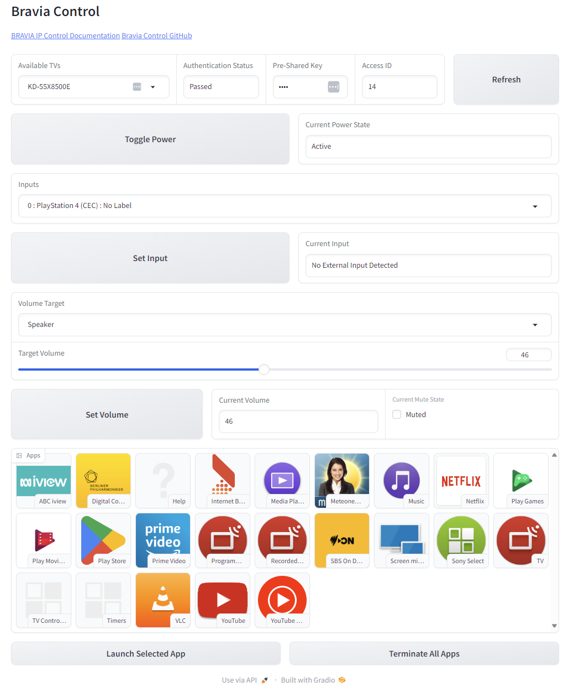

# Bravia Control GUI
A simple web interface written in Python for controlling Sony BRAVIA TVs via the [REST API](https://pro-bravia.sony.net/develop/integrate/rest-api/spec/index.html)  they offer.

You can control:
- Power status
- Current input
- Volume control
- Mute status
- Launching apps
- Terminating apps

For full functionality, a *Pre-Shared Key* is required to authenticate access for each TV. The details of which are outlined [here](https://pro-bravia.sony.net/develop/integrate/ip-control/index.html).

[SSDP](https://en.wikipedia.org/wiki/Simple_Service_Discovery_Protocol) is utilized for discovering TVs automatically on the local network of the current device. Due to limitations and known insecurities with the protocol, you may manually define available TVs inside the `tvs.txt` file if needed, which takes on the following format for each line:

`[tv ip],[pre-shared key]`

Where `[tv ip]` as a valid IPv4 or IPv6 address, and `[pre-shared key]` is the pre-shared key for the corresponding `[tv ip]` for that line. All whitespace and `','` characters are interpreted as part of the pre-shared key after the first instance of `','` for each line.

## Requirements
Python 3.10.0 or higher

requirements.txt:
- setuptools
- gradio>=4.3.0
- ssdpy

Using a python virtual environment is highly recommended.

## The Interface
Begin by selecting a TV from the Available TV's dropdown. If the web page does not appear, it is likely that no TVs were detected, and you may want to manually define them in `tvs.txt`.

Enter a pre-shared key to authenticate access to the current TV.

### The Components
- Available TVs: A dropdown for selecting BRAVIA TVs that can potentially be controlled.
- Authentication Status: Displays if access is authenticated.
- Pre-Shared Key: Enter the pre-shared key needed for authentication to pass.
- Access ID: The current ID being used to access the API.
- Refresh: Refreshes info for the currently selected TV.
- Toggle Power: Changes the power state.
- Current Power State: Displays the power state.
- Inputs: A dropdown for selecting the input to be set.
- Set Input: Sets the input as determined by the Inputs dropdown.
- Current Input: Displays the current input.
- Volume Target: A dropdown for selecting the targeted audio device.
- Target Volume: A slider for selecting the volume to target.
- Set Volume: Sets the volume according to the Target Volume slider.
- Current Volume: Displays the current volume.
- Current Mute State: A chackbox for setting the mute state.
- Apps: A gallery for selecting an app to launch.
- Launch Selected App: Launches the selected app from the Apps gallery.
- Terminate All Apps: Immediately closes all open apps.

## FAQ
- Why are some options unavailable when I select a TV? Most controls are only available if you have authentication. Please see [here](https://pro-bravia.sony.net/develop/integrate/ip-control/index.html) for information on configuring authentication. Input and Audio controls are also unavailable if the currently selected TV is in `Standby` mode.
- Are my credentials stored safely? No. They are stored in plaintext if you use `tvs.txt`. All pre-shared keys are not stored in encrypted memory while this program is running.
- Can I control multiple TVs at once? No. You can only control one TV at a time. Controlling multiple TVs is not the intended purpose of this program.
- Can I change API method versions? No. All of the current GUI features depend only on version 1.0 for all API methods implemented thus far.